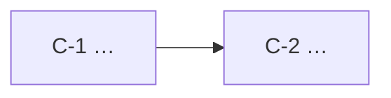
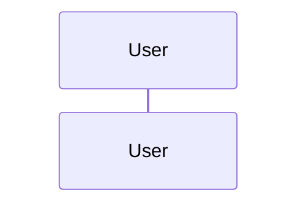

# Architecture — <Project name>

> **Status:** Draft
> **Approved by:**
> **Inputs:** docs/requirements.md

## 1. Context and goals
…

## 2. Options considered
| Option | Pros | Cons | Verdict |
|--------|------|------|---------|

## 3. Component diagram

## 4. Components
| ID | Component | Responsibility | Satisfies |
|----|-----------|----------------|-----------|
| C-1 | … | … | FR-1, NFR-2 |

## 5. Data flow

## 6. Technology choices
| Concern | Choice | Version | Why |
|---------|--------|---------|-----|

## 7. External interfaces
API endpoints, authentication, rate limits, failure modes.

## 8. Configuration and secrets
Environment variables (names only, never values), defaults, `.env.example`.

## 9. Error handling strategy
API failures, missing files, empty repositories, missing fields → `Not Found`.

## 10. Traceability
| Requirement | Component(s) |
|-------------|--------------|

## 11. Revision history
| Date | Change | Reason (e.g. DR-2) |
|------|--------|--------------------|
