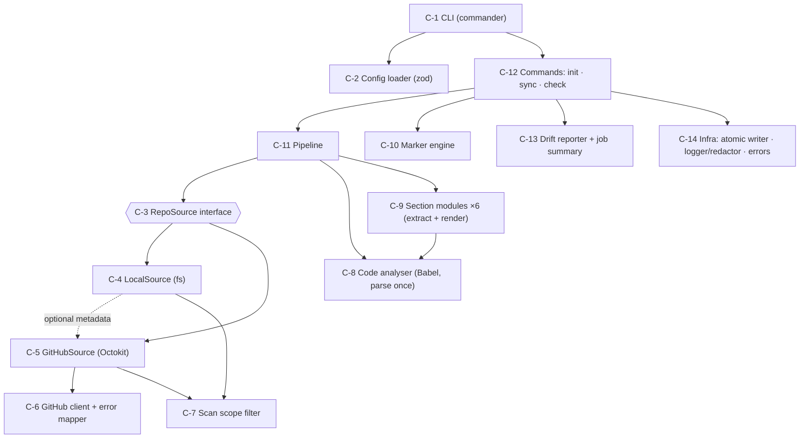
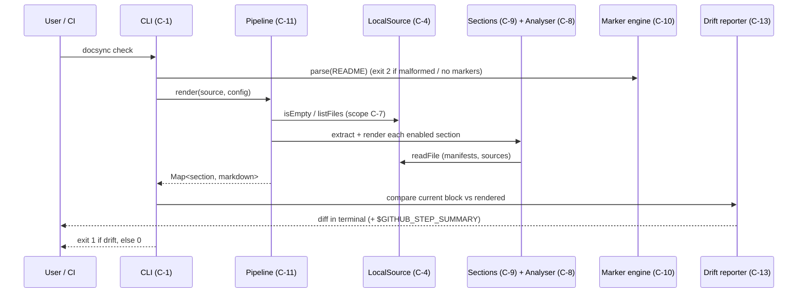
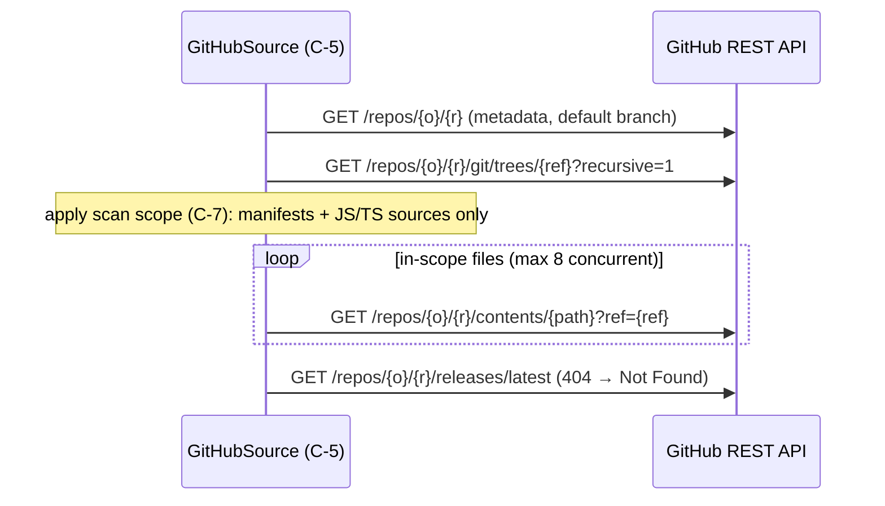

# Architecture — Docs Sync (DOCS-101)

> **Status:** Approved
> **Approved by:** saikusal on 2026-10-01
> **Inputs:** docs/requirements.md (Approved, incl. 2026-10-01 NFR-7 amendment)

## 1. Context and goals
Docs Sync is a **stateless command-line tool**. It reads a JS/TS repository (a local directory, or GitHub via the REST API),
derives facts from the code and metadata, renders them as Markdown, and either rewrites the managed README blocks (`sync`)
or reports how they differ (`check`). It uses no database, no LLM and no server; the only persistent state is the README in git.

Architectural drivers, from the requirements:
1. **Correctness without guessing**: facts are extracted from syntax trees, and a missing fact is `Not Found` (FR-8–13).
2. **Determinism**: identical input gives byte-identical output, which is what makes `check` possible (FR-14, AC2).
3. **Never touch human-written text**: everything outside the markers is preserved byte for byte (FR-4).
4. **Secrets are never read**: `.env` files are excluded where the files are listed, not filtered from the output afterwards (NFR-1).
5. **Testable offline**: every I/O boundary sits behind an interface (NFR-9).
6. **Easy to extend with a new section** (NFR-10).

## 2. Options considered
| Decision | Option | Pros | Cons | Verdict |
|----------|--------|------|------|---------|
| Packaging | **Single CLI package**, CI calls `docsync check` | Simplest to build, test and release; meets FR-24 | Other repos copy a workflow snippet rather than `uses:` an action | **Chosen** (human, Phase 2) |
| | CLI + reusable GitHub Action | `uses: saikusal/docsync@v1` for other repos | Bundling, committed `dist/`, release tags; the story marks it as a follow-up | Deferred (follow-up story) |
| Remote reading | **Git Trees API + Contents API** | Fetches only the in-scope files; matches NFR-6 exactly | About one request per source file; large repos need a token | **Chosen** (human, Phase 2) |
| | Tarball download | One request | Downloads every asset; contradicts NFR-6 | Rejected |
| | Shallow `git clone` | Reuses local mode | Needs git; the token goes into a clone URL (leak risk) | Rejected |
| Code analysis | **Babel parser (syntax tree)** | Handles JS, TS and JSX with one parser; tolerant of errors | Static only (dynamic paths can't be resolved) | **Chosen** |
| | Regex | No dependencies | Misses destructuring and aliases; matches comments | Rejected |
| | TypeScript compiler API | Type information | Heavy (≈ 20 MB), slower; type information isn't needed | Rejected |

## 3. Component diagram


## 4. Components
| ID | Component | Responsibility | Satisfies |
|----|-----------|----------------|-----------|
| C-1 | **CLI** (`src/cli/`) | Parses commands and options with commander, enforces that `--path` and `--repo` aren't both given, maps `DocsyncError.exitCode` to the process exit code, and prints a stack trace only with `--debug`. | FR-1, FR-3, FR-23, exit codes |
| C-2 | **Config loader** (`src/config/`) | Merges defaults ← `docsync.config.json` ← CLI flags. A strict zod schema rejects unknown keys and wrong types, naming the field. | FR-2, FR-3 |
| C-3 | **RepoSource interface** (`src/sources/types.ts`) | `listFiles(): Promise<string[]>` (POSIX relative paths, scope applied) · `readFile(path): Promise<string \| null>` · `getMetadata(): Promise<RepoMetadata \| null>` · `isEmpty(): Promise<boolean>`. Everything downstream depends only on this interface. | NFR-9, FR-17, FR-18 |
| C-4 | **LocalSource** | Walks the file system with `fast-glob`, applies C-7, and reads files as UTF-8. Paths are resolved and checked to stay inside the root. Finds `origin` by reading `.git/config` (no git binary needed); if `GITHUB_TOKEN` is set **and** origin is on github.com, it delegates `getMetadata()` to C-5, otherwise returns `null`. | FR-18, FR-19, NFR-4 |
| C-5 | **GitHubSource** | `GET /repos/{o}/{r}` (metadata, default branch) → `GET /repos/{o}/{r}/git/trees/{ref}?recursive=1` (one call) → applies C-7 to the tree → `GET /repos/{o}/{r}/contents/{path}?ref=` for each in-scope file (at most 8 concurrent requests). Latest release and topics come from the metadata and releases endpoints. A truncated tree response produces a warning. | FR-17, NFR-6 |
| C-6 | **GitHub client + error mapper** | Creates Octokit with the throttling and retry plugins and the token from `process.env.GITHUB_TOKEN` only. Maps errors: 401 → invalid token, 404 → repo not found / no access, 403/429 with rate-limit headers → "rate limited until HH:MM", network/timeout, 5xx after retries. Uses only GET endpoints. | FR-21, NFR-2, NFR-3 |
| C-7 | **Scan scope filter** (`src/scope/`) | One pure function shared by both sources. It decides which paths count as **source files** (JS/TS extensions, minus default excludes, minus test files, minus `.gitignore` rules via the `ignore` package, plus config include/exclude) and which are **always-readable manifests** (`package.json`, `package-lock.json`, `.env.example`, `LICENSE*`). `.env` and `.env.*` (apart from `.env.example`) are **never listed**, so they can't be read. | FR-19, NFR-1 |
| C-8 | **Code analyser** (`src/analysis/`) | Parses each source file once with `@babel/parser` (plugins `typescript` and `jsx`, `errorRecovery: true`) and caches the syntax tree for the run. A parse failure produces a warning and the file is skipped. Provides the visitors: **env usage** (`process.env.X`, `process.env['X']`, destructuring from `process.env`, plus whether a fallback such as `\|\|`, `??` or a default value is present) and **Express routes** (see §5.3). | FR-11, FR-12, FR-22 |
| C-9 | **Section modules** (`src/sections/*.ts`) | Each one exports `{ id, extract(ctx): Promise<Facts>, render(facts): string }`. There are six: `overview`, `tech-stack`, `setup`, `env-vars`, `api-endpoints`, `project-structure`. A registry array lists the enabled modules, so adding a section is one file plus one registry line. Renderers sort every row and contain no timestamps. | FR-8–FR-14, NFR-10 |
| C-10 | **Marker engine** (`src/markers/`) | A pure-string engine. `parse(readme)` returns blocks `{section, contentStart, contentEnd, line}` or errors with line numbers (no end marker, nested block, duplicate, unknown section). `replace(readme, Map<section, content>)` splices new content in by offset, so the bytes outside the blocks are never re-serialised. It detects the README's EOL (CRLF or LF) and renders block content with the same EOL. `insertMissing(readme, sections)` supports `init`. | FR-4, FR-5, FR-6 |
| C-11 | **Pipeline** (`src/core/pipeline.ts`) | `render(source, config) → Map<section, markdown>`: checks for an empty repo, lists the files, builds the analysis context, runs the enabled section modules, and returns the rendered blocks. Commands share it. | FR-14, FR-20 |
| C-12 | **Commands** (`src/commands/`) | `init`: insert the missing blocks (or create a minimal README), show a preview, require `--yes` or confirmation. `sync`: pipeline → marker replace → atomic write (local) or `--out`/stdout (remote); report the changed sections. `check`: pipeline → compare → drift report → exit 1/0; never writes the README. | FR-6, FR-7, FR-15, FR-16 |
| C-13 | **Drift reporter** (`src/report/`) | Per stale section, a unified diff (`diff` package) for the terminal, and Markdown for `$GITHUB_STEP_SUMMARY` when that variable is set. All output goes through the redactor. | FR-16, AC9 |
| C-14 | **Infra** (`src/infra/`) | `DocsyncError` (with `exitCode` 2 or 3); `Logger` (stderr for diagnostics, stdout for results) wrapping a **Redactor** that masks the literal `GITHUB_TOKEN` value and token-shaped strings; `writeFileAtomic` (write a temporary file in the same directory, then rename). | NFR-1, NFR-2, NFR-8, FR-23 |
| C-15 | **CI workflow** (`.github/workflows/ci.yml`) | On `pull_request`: matrix {ubuntu, windows} × Node {22, 24}: `npm ci` → lint → typecheck → test (coverage) → `npm audit --audit-level=high`; then a `docs-check` job: build → `node dist/cli.js check` on this repo's README. Permissions: `contents: read`. | FR-24, NFR-7, NFR-12, AC9 |

## 5. Key design details

### 5.1 The facts model and `Not Found`
```ts
export const NOT_FOUND = Symbol('NotFound');
export type Maybe<T> = T | typeof NOT_FOUND;   // every optional fact uses this
```
Extractors return `Maybe<…>` fields and never `undefined` or empty strings. A shared `fmt(value)` helper in the renderers turns
`NOT_FOUND` into the literal text `Not Found`, so the rule lives in one place and can be checked in code review.

### 5.2 Determinism
- Rows are sorted with `localeCompare(…, 'en')` (routes by path, then method), and file paths use `/` on every OS.
- No timestamps, absolute paths or machine-specific values appear in the output.
- Rendered content ends with exactly one EOL; the marker engine handles the blank lines around it.

### 5.3 Express route resolution (FR-12)
Two passes over the cached syntax trees:
1. **Collect.** For each file, record:
   - *routers*: identifiers bound to `express()`, `express.Router()` or `Router()`
   - *routes*: `<router>.<method>(path, …)` and `<router>.route(path).<method>(…)`, where the method is one of get/post/put/patch/delete/options/head/all
   - *mounts*: `<router>.use('/prefix', <routerRef>)`
   - *exports and imports* of router identifiers (ESM `import`/`export`, and CommonJS `require`/`module.exports`)
2. **Resolve.** Build a mount graph across files by resolving relative import specifiers (trying `.ts .tsx .js .jsx .mjs .cjs` and `/index.*`).
   Each route's full path is the concatenation of the prefixes along its mount chain from the app root, normalised to remove duplicate `/`.
   - A route on a router that is never mounted is listed with its own path (no prefix).
   - A path that isn't a string literal or a template string without expressions becomes `Not Found (dynamic)`.
   - Cycles in the mount graph are detected and the cycle is broken with a warning.

### 5.4 Env var "required" rule (FR-11)
For each use, `required = true` unless the `process.env.X` member expression is the left operand of `||` or `??`,
the test of a conditional (`process.env.X ? … : …`), or a destructured property with a default value (`const { X = 'd' } = process.env`).
A variable is **Required = Yes** if *any* use is required. A variable found only in `.env.example` shows "Used in: `Not Found`" and "Required: `Not Found`".

### 5.5 Data flow — `docsync check` (local)


### 5.6 Data flow — remote mode


## 6. Technology choices
| Concern | Choice | Version | Why |
|---------|--------|---------|-----|
| Runtime | Node.js | ≥ 22.12 (CI on 22, 24) | Supported LTS lines only (NFR-7 as amended) |
| Language | TypeScript (strict) | 6.0.x | Typed facts model. TS 7 isn't supported by typescript-eslint yet (it supports < 6.1) |
| Module format | ESM | — | Matches current Octokit and Node conventions |
| CLI | commander | 15.x | Standard, generates `--help` |
| Config validation | zod | 4.x | Strict schemas with readable errors |
| GitHub API | @octokit/rest + plugin-throttling + plugin-retry | 22.x / 11.x / 8.x | Official client; rate-limit and retry handling (FR-21) |
| Parsing | @babel/parser + @babel/traverse | 7.29.x | Babel 8 isn't on the `latest` tag yet; 7.29 is the stable line and supports TS and JSX |
| File walking / ignores | fast-glob, ignore | 3.x / 7.x | Fast cross-platform globbing; `.gitignore` semantics |
| Diffs | diff | 9.x | Unified diffs for the drift report |
| Tests | vitest + @vitest/coverage-v8 | 5.x | TypeScript-native and fast; coverage built in |
| Lint / format | eslint + typescript-eslint, prettier | 10.x / 8.x / 3.x | Code-quality checklist |
| Build | tsup | 8.x | Bundles `src/cli.ts` into `dist/cli.js` with a shebang |

All dependencies are pinned through `package-lock.json`; `package.json` uses caret ranges within the majors above. No runtime dependency is needed beyond those listed.

## 7. External interfaces
| Interface | Details |
|-----------|---------|
| CLI | `docsync <init\|sync\|check> [--path dir \| --repo owner/repo [--ref r]] [--readme f] [--config f] [--sections a,b] [--out f] [--yes] [--debug]` |
| GitHub REST API | GET only: repos, git/trees, contents, releases/latest. Authenticated with `GITHUB_TOKEN` when present, otherwise anonymous (60 requests/hour). Throttling plugin: wait and retry once on secondary rate limits; fail with a reset time on the primary limit. |
| GitHub Actions | Reads `GITHUB_STEP_SUMMARY` (a file path) and appends Markdown to it. |
| File system | Reads in-scope files under the target root; writes only the README (`sync`/`init`) or the `--out` file. |

## 8. Configuration and secrets
- `GITHUB_TOKEN` (optional): environment variable only. It is never accepted as a flag, never logged, and the redactor masks it. `.env.example` lists it by name.
- `docsync.config.json` (optional):
  ```json
  { "readme": "README.md", "sections": ["overview","tech-stack","setup","env-vars","api-endpoints","project-structure"],
    "include": ["src/**"], "exclude": ["scripts/**"] }
  ```
- Precedence: CLI flags > config file > defaults.

## 9. Error handling strategy
| Situation | Behaviour | Exit |
|-----------|-----------|------|
| Bad flags, invalid config, malformed or missing markers, missing README | One-line error + the next step (e.g. "run `docsync init`") | 2 |
| Empty repository | "repository is empty" | 3 |
| GitHub 401 / 404 / rate limit / network / 5xx | Specific message from C-6; token redacted | 3 |
| File that can't be parsed | Warning (file + reason); continue | — |
| Missing fact | `Not Found` in the output; not an error | — |
| Unexpected exception | "Unexpected error, re-run with --debug" | 3 |

All errors are `DocsyncError` subclasses, which are caught in a single place (C-1). No `process.exit` calls appear anywhere else.

## 10. Project structure
```
src/
  cli.ts                 entry (C-1)
  config/                C-2
  sources/  types.ts local.ts github.ts githubClient.ts   C-3..C-6
  scope/                 C-7
  analysis/ parse.ts env.ts routes.ts                     C-8
  sections/ index.ts overview.ts techStack.ts setup.ts envVars.ts apiEndpoints.ts projectStructure.ts   C-9
  markers/               C-10
  core/pipeline.ts       C-11
  commands/ init.ts sync.ts check.ts                      C-12
  report/                C-13
  infra/ errors.ts logger.ts redact.ts atomicWrite.ts     C-14
tests/
  unit/  integration/  fixtures/<named-repos>/
.github/workflows/ci.yml C-15
```

## 11. Testing strategy (summary — detailed in the implementation plan)
- **Unit tests:** marker engine, scope filter, env and route visitors, every renderer (snapshot tests), config merging, error mapping, redactor.
- **Integration tests:** whole commands against fixture repositories in `tests/fixtures/` (express-basic, no-license, empty, malformed-markers, with-dotenv) through LocalSource; GitHubSource through a fake `fetch` injected into Octokit (`request.fetch`), so there is **no network access** in tests (NFR-9).
- **Security tests:** a sentinel value in a fixture `.env` must not appear in any output (NFR-1); a token set together with forced API errors must not appear in any output (NFR-2).
- **Performance test:** a generated 500-file fixture syncs in under 10 s (NFR-5).

## 12. Traceability
| Requirement | Component(s) |
|-------------|--------------|
| FR-1 | C-1 |
| FR-2, FR-3 | C-2, C-1 |
| FR-4, FR-5 | C-10 |
| FR-6, FR-7 | C-12, C-10 |
| FR-8 | C-9 (overview), C-5/C-4 metadata |
| FR-9, FR-10 | C-9 (tech-stack, setup) |
| FR-11 | C-8 (env), C-9 (env-vars) |
| FR-12 | C-8 (routes), C-9 (api-endpoints) |
| FR-13 | C-9 (project-structure) |
| FR-14 | C-9, C-11 |
| FR-15, FR-16 | C-12, C-13 |
| FR-17 | C-5, C-6 |
| FR-18 | C-4 |
| FR-19 | C-7 |
| FR-20 | C-11 |
| FR-21 | C-6 |
| FR-22 | C-8 |
| FR-23 | C-1, C-14 |
| FR-24 | C-15 |
| NFR-1 | C-7, C-14 |
| NFR-2, NFR-3 | C-6, C-14 |
| NFR-4 | C-4, C-2 |
| NFR-5 | C-8 (parse once), C-4 |
| NFR-6 | C-5 |
| NFR-7, NFR-12 | C-15 |
| NFR-8 | C-14 |
| NFR-9 | C-3, C-6 |
| NFR-10 | C-9 |
| NFR-11 | C-1, C-14 |

Every FR and NFR maps to at least one component; no gaps.

## 13. Known risks (input to the design review)
- Static route resolution misses routes registered in loops or through helper functions; these are documented as a limitation.
- The Git Trees API truncates very large trees (> 100k entries / 7 MB); this produces a warning, and the result may be incomplete.
- Anonymous remote mode exhausts the 60-requests-per-hour limit on repos with more than about 55 source files, so a token is needed.

## 14. Revision history
| Date | Change | Reason |
|------|--------|--------|
| 2026-10-01 | Initial version | Phase 2 |
