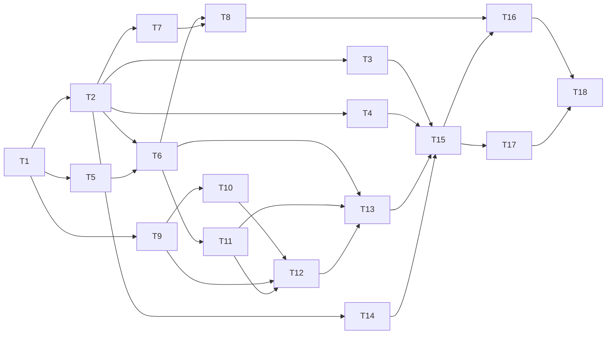

# Implementation Plan — Docs Sync (DOCS-101)

> **Status:** Approved
> **Approved by:** saikusal (delegated) on 2026-10-01
> **Inputs:** docs/requirements.md, docs/architecture.md (rev 2), docs/design-review.md

## Tasks (dependency order)
Each task is one reviewable diff that ships with its own tests. "Done when" is the exit check.

| ID | Title | Component | Requirements | Depends on | Done when |
|----|-------|-----------|--------------|------------|-----------|
| T-1 | Project scaffolding: package.json (ESM, `bin`, `engines >=22.12`), tsconfig (strict), eslint, prettier, vitest, tsup | — | NFR-7, NFR-12 | — | `npm run lint`, `npm run typecheck`, `npm test` and `npm run build` all pass on an empty smoke test |
| T-2 | Infra: error types and exit codes, redactor, logger, atomic writer with Windows retry | C-14 | NFR-1, NFR-2, NFR-8, FR-23, DR-7 | T-1 | Unit tests: redaction of the token and token-shaped strings; atomic write; retry on a simulated EPERM |
| T-3 | Config loader: zod schema, defaults ← file ← flags, input validation | C-2 | FR-2, FR-3 | T-2 | Tests: precedence, unknown key, wrong type, bad `--repo`, unknown section |
| T-4 | Marker engine: parse, replace, insertMissing; BOM; per-block EOL | C-10 | FR-4, FR-5, FR-6, DR-6 | T-2 | Tests: byte-identical outside the blocks (LF, CRLF, mixed, BOM); every malformed case reports a line number |
| T-5 | Scope filter and `.env.example` key-name parser | C-7 | FR-19, NFR-1, DR-2 | T-1 | Tests: default excludes, test files, .gitignore, config include/exclude, `.env*` never listed, values discarded |
| T-6 | RepoSource interface and LocalSource (recursive walk, path safety, empty check, origin detection) | C-3, C-4 | FR-18, FR-20, NFR-4, DR-14 | T-2, T-5 | Tests on temporary directories: listing, a traversal path rejected, empty repo detected, `.git/config` origin parsed |
| T-7 | GitHub client factory and error mapper | C-6 | FR-21, NFR-2, NFR-3 | T-2 | Tests with a fake fetch: 401, 404, rate limit (reset time shown), 5xx, network error; token never appears in messages |
| T-8 | GitHubSource: SHA resolution, tree, scope, skip rules, quota pre-check, blob reads; local metadata delegation | C-5 | FR-17, FR-18, NFR-6, DR-3, DR-4, DR-5 | T-6, T-7 | Tests with a fake fetch: request count, truncated tree → exit 3, quota fail-fast, symlink/submodule/large file skipped |
| T-9 | Code analyser: parse once, env usage visitor with the "required" rule | C-8 | FR-11, FR-22, DR-1, DR-2, DR-10 | T-1 | Tests: every access form, fallbacks vs guards, dynamic key skipped, a syntax error becomes a warning with no code frame |
| T-10 | Express route visitor and cross-file mount resolution | C-8 | FR-12, DR-15 | T-9 | Tests: app/router/route() chains, mounted prefixes across ESM and CJS files, one-hop re-export, dynamic path, cycle |
| T-11 | Facts model plus the overview, tech-stack, setup and project-structure sections | C-9 | FR-8, FR-9, FR-10, FR-13, FR-14, DR-9, DR-11 | T-6 | Snapshot tests per renderer; Not Found cases (no license, no engines, empty lists); lockfile v3 |
| T-12 | env-vars and api-endpoints sections | C-9 | FR-11, FR-12, FR-14, DR-9 | T-9, T-10, T-11 | Snapshot tests; AC1 and AC3 data render correctly; sorted output |
| T-13 | Pipeline: empty-repo guard, section registry, render map | C-11 | FR-14, FR-20, NFR-10 | T-6, T-11, T-12 | Test: same input rendered twice is identical; empty repo → exit 3 |
| T-14 | Drift reporter: unified diff and job summary (capped) | C-13 | FR-16, DR-13 | T-2 | Tests: diff text, summary file written when `GITHUB_STEP_SUMMARY` is set, truncation note |
| T-15 | Commands init / sync / check and CLI wiring (commander, exit-code mapping, `--debug`) | C-1, C-12 | FR-1, FR-6, FR-7, FR-15, FR-16, FR-23, DR-12 | T-3, T-4, T-13, T-14 | CLI tests: `--help`, `--path`/`--repo` conflict, init non-TTY guard, sync writes, check exit codes 0/1/2/3 |
| T-16 | Integration and acceptance suite: fixture repos, AC1–AC8, contract test, secret sentinels, 500-file performance test | tests | AC1–AC8, NFR-1, NFR-2, NFR-5, NFR-9, DR-16 | T-8, T-15 | All acceptance tests pass with the network disabled |
| T-17 | Dogfooding: `docsync init` and `sync` on this repo's README | — | FR-24, DR-8 | T-15 | README has all six blocks; `docsync check` exits 0 |
| T-18 | CI workflow: matrix (ubuntu, windows) × (Node 22, 24); lint, typecheck, test, audit; docs-check job | C-15 | FR-24, NFR-7, NFR-12, AC9 | T-16, T-17 | The workflow file is valid; every step passes locally (CI itself is proven on the PR) |

## Dependency graph

## Blocked tasks
| Task | Blocked by | Reason |
|------|------------|--------|
| T-8 | T-6, T-7 | Needs the source interface and the error-mapping client |
| T-12 | T-9, T-10, T-11 | Needs the analyser output and the facts model |
| T-13 | T-11, T-12 | Needs all six section modules |
| T-15 | T-3, T-4, T-13, T-14 | Commands combine config, markers, pipeline and report |
| T-16 | T-8, T-15 | End-to-end tests need both sources and the commands |
| T-17 | T-15 | Needs a working CLI to dogfood |
| T-18 | T-16, T-17 | The docs-check job fails until this repo's README has markers and is in sync (DR-8) |

**Can run in parallel:** {T-3, T-4, T-7, T-14} after T-2; {T-5, T-9} after T-1; T-10 alongside T-6/T-11.

## Progress
- [ ] T-1 · [ ] T-2 · [ ] T-3 · [ ] T-4 · [ ] T-5 · [ ] T-6 · [ ] T-7 · [ ] T-8 · [ ] T-9
- [ ] T-10 · [ ] T-11 · [ ] T-12 · [ ] T-13 · [ ] T-14 · [ ] T-15 · [ ] T-16 · [ ] T-17 · [ ] T-18

## Risks
| Risk | Mitigation |
|------|------------|
| Static route analysis misses routes created at runtime | Known Limitation; dynamic paths are shown as `Not Found (dynamic)` |
| Windows file locking during sync | DR-7 retry and back-off; Windows in the CI matrix |
| GitHub API quota during manual remote runs | DR-4 pre-check; all tests use a fake fetch |
| A library major version breaks something | Versions pinned in the lockfile; `npm audit` in CI |

## Definition of Done
All 18 tasks are ticked. Lint, typecheck and tests are green. `npm audit --audit-level=high` is clean. AC1–AC9 are covered by
named tests. This repo's own README is managed by docsync and passes `check`. Code review (Phase 6) and verification (Phase 7) are approved.

## Delegated decisions
- The task granularity and order above were chosen by the agent under saikusal's delegation of 2026-10-01.
- Per-task diffs are approved under the same delegation (Phase 5); each task is still its own commit for traceability.
